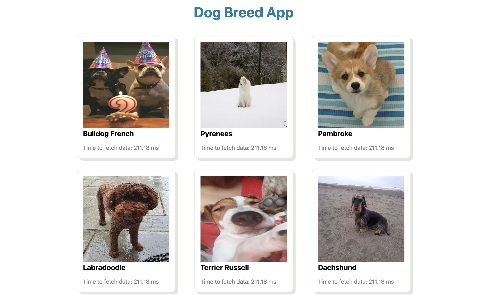

## Live Site
https://dog-breed-5yuvxeant-thecoachanna.vercel.app/

## Challenge

:white_check_mark: 1 - request 3 random dog breeds from the url, https://dog.ceo/api/breeds/image/random

:white_check_mark: 2 - In a row, render images (sized 240px x 240px) of all 3 dog breeds

:white_check_mark: 3 - render the name of the breed, spelled out with no dashes and capitalized first letter of each word in the name. (e.g. "blood-hound" would be "Blood Hound")

## Bonus

:white_check_mark: 1 - make the UI responsive such that, when the screen is too narrow, the dog breeds are rendered in a column

:white_check_mark: 2 - display how many seconds it took to fetch each breed from the API (e.g .012 seconds).  Display it underneath the picture of each breed.

:white_check_mark: 3 - create a separate "DogBreed" component that renders each dog breed.  The DogBreed component should take 3 props: imageUrl, name, and number of seconds to load the data for the given breed. The DogBreed component should get rendered from within the index.js file.

## Additional Items

:white_check_mark: 1 - fix all eslint errors (vs code should auto highlight them for you but you can also run the lint check with "npm run lint" from the cli)

:white_check_mark: 2 - use the NextJS Image component to display each image

:white_check_mark: 3 - display 9 breeds on page load instead of 3 + add styling

:white_check_mark: 4 - clicking on any of the breeds navigates you to a new page (display all images for breed)

:white_check_mark: 5 - hovering over the clickable breed changes the cursor to be a pointer to make it clear that the breed is clickable

## Screenshot

## Resources

NextJS Docs
https://nextjs.org/docs/basic-features/data-fetching/get-server-side-props

NextJS Image Component
https://nextjs.org/docs/api-reference/next/image

NextJS Dynamic Routes
https://nextjs.org/docs/routing/dynamic-routes

